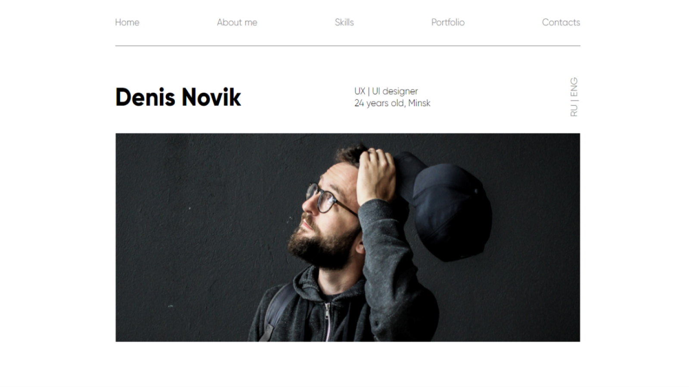

# Dmitry Siergeichyk

## Beginner frontend developer

---

## About me

Hello! I am a beginner frontend developer. I have been studying
this area for about two months. Before that, for two years, I
worked as a teacher at a music school. I like the profession of
a front-end developer because you can endlessly develop in it,
therefore, I hope to achieve great success.

---

## Skills

- HTML - 40%
- CSS/SASS - 40%
- JAVASCRIPT - 10%
- GIT - 20%
- FIGMA - 20%

---

## Projects




---

## Code Example

```
function moveZeros(arr) {
   let arrSmall = [];
      for (let i = 0; i < arr.length; i++){
         let val = arr[i];
      if (val === 0){
         arrSmall.push(...arr.splice(i, 1));
         i--;
      }
   }
   return arr.concat(arrSmall);
}
```

---

## Education

- 2011-2016 **Secondary School No. 26 (Grodno)** Middle-school

- 2016-2020 **Grodno State College of Music** Piano, Bayan, Accodreon

---

## Languages

- English - B1
- Russian - C2
- Polish - A2

---

## Contact

**Email:** sergdim7@gmail.com

**GitHub:** [@intelligentRaji](https://github.com/intelligentRaji "Github")
